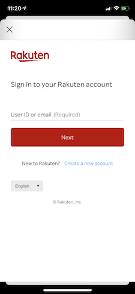
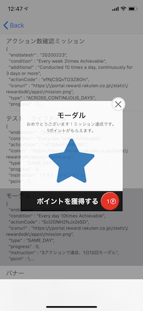
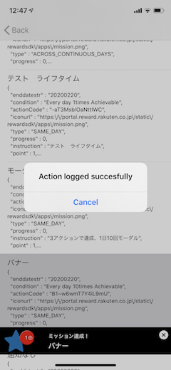

[TOP](../../README.md#top)　>　Basic Guide

Table of Contents
* [Region Setting](#region-setting)<br>
* [Authentication](#authentication)<br>
  * [Login Options](#login-options)<br>
  * [Log in](#log-in)<br>
  * [Log out](#log-out)<br>
* [Initialize SDK](#initialize-sdk)<br>
* [Getting User Information](#getting-user-information)<br>
* [Mission Achievement](#mission-achievement)<br>
* [SDK Portal](#sdk-portal)<br>
* [Ad Portal](#sdk-portal)<br><br>

# Region Setting
From Version 2.1, SDK support multiple regions.
We support Japan, Taiwan(2021/02).

For Japan
```objective-c
RakutenReward.shared.region = RakutenRewardRegionJP;
```

For Taiwan
```objective-c
RakutenReward.shared.region = RakutenRewardRegionTW;
```

Do not use multiple setting in same app.  
We expect one application use one region.  
Each Region has differrent functions, and we cannot support each country mixed.
<br><br>

# Authentication

## Login Options
There are 3 types of login. According to your environment, please select proper one. 
<br>

| Login Option        | Description | Support |
| --- | --- | --- |
| RakutenAuth | This is default option, provide login by SDK, SDK handled all login and user identifier | Japan, Taiwan |
| RID | Rakuten ID SDK with RID, Login covers by ID SDK, and use API token for SDK| Japan |  
| RAE | Rakuten ID SDK with RAE, Login covers by ID SDK, and use token for SDK | Japan |
<br>

### Switch Login Option
By default, login option is RakutenAuth
<br>

### RakutenAuth
```objective-c
RakutenReward.shared.tokenType = TokenTypeRakutenAuth;
```
<br>

### RID

To use SDK API, developers need to set token type after login

```objective-c
RakutenReward.shared.tokenType = TokenTypeRID;
```

and pass (API-C) token value in startSession API. Access token value will be set automatically when startSessionAPI returns success

```objective-c
[RakutenReward.shared startSessionObjcWithAppCode:@"AppcodeExample" accessToken:@"AccessTokenExample" completion:^(SDKUserObject * _Nullable user, RewardSDKSessionErrorObjc * _Nullable error) {
    if (error != nil) {
        // Has Error
    }
    
    // Successful
}];
```
<br>

### RAE
To use SDK API, developers need to set token type after login

```objective-c
RakutenReward.shared.tokenType = TokenTypeRAE;
```

and pass access API token value in startSession API. Access token value will be set automatically when startSessionAPI returns success

```objective-c
[RakutenReward.shared startSessionObjcWithAppCode:@"AppcodeExample" accessToken:@"AccessTokenExample" completion:^(SDKUserObject * _Nullable user, RewardSDKSessionErrorObjc * _Nullable error) {
    if (error != nil) {
        // Has Error
    }
    
    // Successful
}];
```
<br>

## Log In

This is for external login options, If you use Rakuten Login SDK, you don't need to use this option.
<br>

```objective-c
[RakutenReward.shared openLoginPage:^(enum LoginPageCompletion completion) {
    switch (completion) {
        case LoginPageCompletionDismissByUser: // resume in another time
            break;
        case LoginPageCompletionLogInCompleted: // starting session
            break;
        case LoginPageCompletionFailToShowLoginPage: // presenting problem
            break;
    }
}];
```


<br>

## Log out

Logging user out: 

```objective-c
[RakutenReward.shared logoutWithCompletion:^{ }];
```
<br>

# Initialize SDK
To use Reward SDK, need to establish SDK session first (to collect SDK user's basic information)

Call startSession method with parameters


```objective-c
[RakutenReward.shared startSessionObjcWithAppCode:@"AppcodeExample" accessToken:@"AccessTokenExample" completion:^(SDKUserObject * _Nullable user, RewardSDKSessionErrorObjc * _Nullable error) {
    if (error != nil) {
        // Has Error
    }
    
    // Successful
}];
```

| Parameter name        | Description           
| --- | --- 
| appCode | Application Key (This is from Rakuten Reward Developer Portal) 
| token | Access token to access Reward SDK API-C API |
<br>

## Initialization flow with Built-in Login service
1. Check if user has logged in to Reward SDK, 
2. if not open log in page
3. Start session after log in 

```objective-c
if (RakutenReward.shared.isLogin) {
    [RakutenReward.shared startSessionObjcWithAppCode:@"AppcodeExample" completion:^(SDKUserObject * _Nullable user, RewardSDKSessionErrorObjc * _Nullable error) {
                
    }];
} else {
    [RakutenReward.shared openLoginPage:^(enum LoginPageCompletion completion) {
                
    }];
}
```
<br>

# Getting user information

### Get user's full name

```objective-c
[RakutenReward.shared.getUserObjc getName];
```

### Get user Current point and rank: 

```objective-c
[RakutenReward.shared.getUserObjc currentPointRank];
```
<br>

# Mission Achievement 
To achieve mission, developers need to call post action API.  
After achieving the mission, notification will be shown.  
<br>

## Post Action
```objective-c
[RakutenReward.shared logActionObjcWithActionCode:@"ActionCodeExample" completion:^(NSError * _Nullable error) {
        if (error != nil) {
            // Has error
        }
        
        // Success
}];
```
actionCode is provided by Reward SDK Developer Portal.  
<br>

## Notification UI
The user achieved the mission, notification UI is shown.  
Reward SDK provides Modal and Banner UI

     
<br>

### Notification Type
There  are 4 types of Mission Achievement UI. Modal, Banner, and No UI, and Custom which developed by developers.

You can decide type by Developer Portal 

| Notification Type        | UI
| --- | ---
| Modal | Show Modal UI provided by SDK
| Banner | Show Banner UI provided by SDK
| Custom | Developer can create UI by themselves
| No UI | Not show any UI
<br>

# SDK Portal
We provide User Portal UI for developers. In SDK Portal, developers can see user status (mission, unclaim list, current point, point history etc...)
<br>

Call Open SDK Portal API:
```objective-c
[RakutenReward.shared openPortalObjc:^(SDKErrorObjc * _Nullable error) {
    if (error != nil) {
        // Has error
        
        // Error type
        if ([error isKindOfClass:[SDKErrorObjcNoMissionFound class]]) {}
        else if ([error isKindOfClass:[SDKErrorObjcNoUnclaimedItemFound class]]) {}
        else if ([error isKindOfClass:[SDKErrorObjcSessionNotInitialized class]]) {}
        else if ([error isKindOfClass:[SDKErrorObjcFeatureDisabledByUser class]]) {}
        else if ([error isKindOfClass:[SDKErrorObjcSDKStatusNotOnline class]]) {}
    }
    
    // Success
}];
```

Below are the portal UIs:


<br>

# Ad Portal
*Ad Portal APIs are available from version 3.1.0 (JP region only)
<br>

Call Open Ad Portal API:
```objective-c
[RakutenReward.shared openAdPortalWithCompletionHandler:^(OpenAdPortalCompletion * _Nonnull error) { 
    // Handle success or fail to open ad portal
}];
```

Below are the ad portal UIs:


<br>

LANGUAGE :
> [](../ja/basic/README.md)
