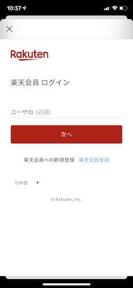
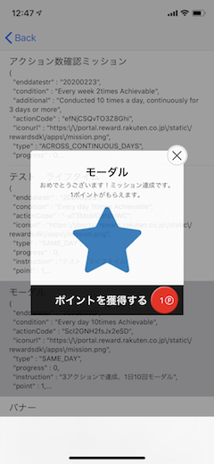
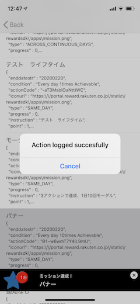
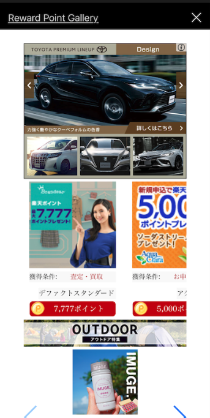

[TOP](../README.md#top)　>基本ガイド

コンテンツ
* [リージョンの設定](#リージョンの設定)<br>
* [認証](#認証)<br>
  * [ログインオプション](#ログインオプション)<br>
  * [ログイン](#ログイン)<br>
  * [ログアウト](#ログアウト)<br>
* [SDKを初期化する](#SDKを初期化する)<br>
* [楽天メンバー情報を取得する](#楽天メンバー情報を取得する)<br>
* [ミッションの達成](#mission-achievement)<br>
* [SDK ポータル](#SDK-ポータル)<br>
* [広告ポータル](#広告ポータル)<br><br>


# リージョンの設定

日本の場合
```objective-c
RakutenReward.shared.region = RakutenRewardRegionJP;
```

# 認証
## ログインオプション

リワードSDKでは3種類のログインを用意しております、環境に合わせてご利用ください
<br>
注記: RAEは2025年までに廃止されます。RIDトークンまたは他のソリューションへの移行計画を立ててください。この列挙型ケースは将来のリリースで削除される予定です。<br>

| ログインオプション | 説明 | サポート |
| --- | --- | --- |
| RakutenAuth | 初期設定、ログインに関する処理はSDKから提供されます | 日本、台湾 |
| RID | 楽天のログインSDKを使って、RIDでログインする場合はこのオプションを使用します、 SDKにAPIトークンを設定する必要があります | 日本 |  
| RAE | 楽天のログインSDKを使って、RAEでログインする場合はこのオプションを使用します、 SDKにトークンを設定する必要があります | 日本 |
<br>

### ログインオプションの切り替え
初期設定では、ログインオプションは RakutenAuth　になっております
<br>

### RakutenAuth
```objective-c
RakutenReward.shared.tokenType = TokenTypeRakutenAuth;
```
<br>

### RID

SDKのAPIを使用するのに、トークンタイプをセットする必要があります  

```objective-c
RakutenReward.shared.tokenType = TokenTypeRID;
```

startSession を呼び出します

```objective-c
[RakutenReward.shared startSessionObjcWithAppCode:@"AppcodeExample" accessToken:@"AccessTokenExample" completion:^(SDKUserObject * _Nullable user, RewardSDKSessionErrorObjc * _Nullable error) {
    if (error != nil) {
        // エラー
    }
    
    // 成功
}];
```
<br>

### RAE

注記: RAEは2025年までに廃止されます。RIDトークンまたは他のソリューションへの移行計画を立ててください。この列挙型ケースは将来のリリースで削除される予定です。

SDKのAPIを使用するのに、トークンタイプをセットする必要があります

```objective-c
RakutenReward.shared.tokenType = TokenTypeRAE;
```

startSession を呼び出します

```objective-c
[RakutenReward.shared startSessionObjcWithAppCode:@"AppcodeExample" accessToken:@"AccessTokenExample" completion:^(SDKUserObject * _Nullable user, RewardSDKSessionErrorObjc * _Nullable error) {
    if (error != nil) {
        // エラー
    }
    
    // 成功
}];
```
<br>

## ログイン

ログインページを開きます。楽天のログインSDKを使用する場合は必要ありません。
<br>

```objective-c
[RakutenReward.shared openLoginPage:^(enum LoginPageCompletion completion) {
    switch (completion) {
        case LoginPageCompletionDismissByUser: // resume in another time
            break;
        case LoginPageCompletionLogInCompleted: // starting session
            break;
        case LoginPageCompletionFailToShowLoginPage: // presenting problem
            break;
    }
}];
```


<br>

## ログアウト

ユーザーログアウト: 

```objective-c
[RakutenReward.shared logoutWithCompletion:^{ }];
```
<br>

---
# SDKを初期化する
楽天リワードSDKを利用するにははじめに初期化が必要です(SDKユーザーの基本データを取得します) SDKの機能を利用するのにはRakutenRewardクラスのメソッドを利用します

バージョン６.１.０以降
```objective-c
[RakutenReward.shared startSessionObjcWithAppCode:@"AppcodeExample" accessToken:@"AccessTokenExample" tokenType:(enum TokenType) completion:^(SDKUserObject * _Nullable user, RewardSDKSessionErrorObjc * _Nullable error) {
    if (error != nil) {
        // Has Error
    }
    
    // Successful
}];
```

バージョン６.１.０の前
```objective-c
[RakutenReward.shared startSessionObjcWithAppCode:@"AppcodeExample" accessToken:@"AccessTokenExample" completion:^(SDKUserObject * _Nullable user, RewardSDKSessionErrorObjc * _Nullable error) {
    if (error != nil) {
        // エラー
    }
    
    // 成功
}];
```

| パラメータ名        | 説明           
| --- | --- 
| appCode | アプリケーションキー (楽天リワードSDKの開発者ポータルより取得) |
| token | APIトークン |
| tokenType | ridかrae（バージョン６.１.０以降）|

# ログインページを表示し、SDKを初期化する
1. ログインの状態をチェックする, 
2. ログインページを表示する
3. SDKを初期化する

```objective-c
if (RakutenReward.shared.isLogin) {
    [RakutenReward.shared startSessionObjcWithAppCode:@"AppcodeExample" completion:^(SDKUserObject * _Nullable user, RewardSDKSessionErrorObjc * _Nullable error) {
                
    }];
} else {
    [RakutenReward.shared openLoginPage:^(enum LoginPageCompletion completion) {
                
    }];
}
```
<br>

## 楽天メンバー情報を取得する　

### ユーザーの名前を取得する

```objective-c
[RakutenReward.shared.getUserObjc getName];
```

### ユーザーの会員ランク楽天ポイントを取得する

```objective-c
[RakutenReward.shared.getUserObjc currentPointRank];
```

---
# ミッションの達成 
ミッションを達成するには、開発者はアクションAPIをコールします
ミッション達成後、ミッション達成UIが表示されます 

## アクションを送信する
```objective-c
[RakutenReward.shared logActionObjcWithActionCode:@"ActionCodeExample" completion:^(NSError * _Nullable error) {
        if (error != nil) {
            // エラー
        }
        
        // 成功
}];
```
actionCode は開発者ポータルより取得します 

## ミッション達成UI
ユーザーがミッションを達成すると、下記のようなミッション達成UIが表示されます
楽天リワードではモーダルとバナーを用意しております

     

### ミッション達成UIの種類
楽天リワードSDKは4つの種類のミッション達成の種類があります
モーダル、バナー、UIなし、カスタム
これらの設定は開発者ポータルから設定できます

| ミッション達成UIの種類        | 説明
| --- | ---
| モーダル | モーダルUIを表示する
| バナー | バナーUIを表示する
| カスタム | 開発者が自由にUIを作成できます
| 広告バナー（小）/ Banner_50 | SDK が提供する Banner_50 UI を表示する
| 広告バナー（大）/ Banner_250 | SDK が提供する  Banner_250 UI を表示する
| UIなし | UIを表示しません

## SDK ポータル

ユーザーにリワードサービスの情報(ミッションや進捗、ポイントなど)を伝えるために
楽天リワードSDKではポータルというのを提供しております
このポータルを表示するにはポータル表示のAPIを呼ぶ必要があります

```objective-c
[RakutenReward.shared openPortalObjc:^(SDKErrorObjc * _Nullable error) {
    if (error != nil) {
        // エラー
        
        // エラー type
        if ([error isKindOfClass:[SDKErrorObjcNoMissionFound class]]) {}
        else if ([error isKindOfClass:[SDKErrorObjcNoUnclaimedItemFound class]]) {}
        else if ([error isKindOfClass:[SDKErrorObjcSessionNotInitialized class]]) {}
        else if ([error isKindOfClass:[SDKErrorObjcFeatureDisabledByUser class]]) {}
        else if ([error isKindOfClass:[SDKErrorObjcSDKStatusNotOnline class]]) {}
    }
    
    // 成功
}];
```

こちらがSDKポータルのイメージになります


## 広告ポータル
Ad Portal API は SDKバージョン3.1.0 からご利用可能です(JP のみ)
<br>

Open Ad Portal API を呼んでください
```objective-c
[RakutenReward.shared openAdPortalWithCompletionHandler:^(OpenAdPortalCompletion * _Nonnull error) { 
    // Handle success or fail to open ad portal
}];
```

こちらが 広告ポータルのユーザーインターフェースになります:



<br>

---
言語 :
> [](../../basic/README.md)
