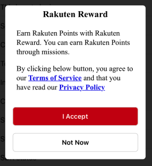
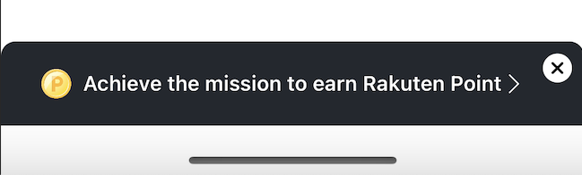

[TOP](../../README.md#top)　>　Request User Consent

Table of Contents
* [Overview](#request-user-consent-feature-overview)<br>
* [Changes to existing API](#changes-to-existing-api) <br>
    * [userNotConsent status](#usernotconsent-status) <br>
    * [UserConsent callbacks](#userconsent-callbacks) <br>
* [Request User Consent API](#request-user-consent-api) <br>
* [Show consent notification banner](#show-consent-notification-banner) <br>
* [Sample Use Case](#sample-use-case)
    * [When to request user consent](#when-to-request-user-consent)
    * [Example for other APIs](#example-for-other-apis)
* [How to Test](#how-to-test)

---
# Request User Consent feature Overview
Since version 5.0.0, Reward SDK integrated request user consent feature. <br>
In order to use Reward SDK's features, users have to provide their consent for Reward term of use and privacy policy first. <br>
Below will go through how to request for user consent and the changes to existing API. <br>

# Changes to existing API
## userNotConsent status
New Reward SDK status is introduced as mentioned [here](../APIReference/README.md#rakutenrewardstatus). <br>
`userNotConsent` status will be returned in `RakutenReward.shared.didUpdateStatus: ((RakutenRewardStatus) -> Void)?` when the user have not provide consent yet. <br>

This status will be updated when startSession API is called and if user has not agree to Reward SDK's terms and condition. <br>

## UserConsent callbacks
New callback is added to RakutenReward as mentioned [here](../APIReference/README.md#rakutenreward). <br>
`RakutenReward.shared.didPresentConsentUI` will be triggered whenever a consent dialog is presented.
`RakutenReward.shared.didDismissConsentUI` will be triggered whenever a consent dialog is dismissed.

# Request User Consent API
New API is introduced to request for user consent. 

```Swift
RakutenReward.shared.requestForConsent { status in
    // Check consent status
}
```
If user have not provide consent yet, a consent dialog will be shown. 



Depends on user action, will the following consent status will be return in the callback.

| RakutenRewardConsentStatus | Description |
| --- | --- |
| consentProvided | User already provide consent |
| consentNotProvided | User have not provide consent |
| consentFailed | There is some error with API request |
| consentProvidedRestartSessionFailed | User provided consent but failed to restart SDK session |

If user already provided consent, the consent dialog will not be shown and the callback will be triggered with `consentProvided` status.

# Show consent notification banner
New API is introduced to show notification banner when user haven't provide consent.  

```swift
RakutenReward.shared.showConsentBanner { status in
    // Check consent status 
}
```

  

The banner above will only be shown when user haven't provide consent. When tap on the banner, consent dialog will be shown to request user's consent.   
If user already provided consent, the banner will not be shown and the callback will be triggered with `consentProvided` status.  

# Sample Use Case
## When to request user consent
Reward SDK will not display consent dialog on behalf of client app unless `RakutenReward.shared.requestForConsent()` API is called. <br>
So client app developers can decide which screen to display the consent dialog.

> `RakutenReward.shared.openPortal()` API will handle the case where user haven't provide consent. <br>
> After user provided the consent will proceed to open SDK portal page. <br>
> If user don't provide consent, SDK portal page will not be shown.

Sample code on when to request user consent
```Swift
    // Callback when SDK status is updated
    RakutenReward.shared.didUpdateStatus = { sdkStatus in
        // If SDK status is changed to user not consent
        if sdkStatus == .userNotConsent {
            // Request for user consent, SDK will present the consent UI
            RakutenReward.shared.requestForConsent { consentStatus in
                // Handle next action depending on consentStatus
            }
        }
    }
```

## Example for other APIs

Most of the SDK APIs will fail if SDK status is not Online. This includes the situation where SDK Status is .userNotConsent.
One of the way to handle is with the code below

```Swift
func exampleLogAction() {
    // Check if SDK is online...
    
    // Check if SDK status is user not consent
    RakutenReward.shared.requestForConsent { consentStatus in
        // Call the API if consent is provided
    }
}
```

Even if user already provided consent, it is still safe to call `RakutenReward.requestForConsent()` API as consent dialog will not be shown and `consentProvided` status will be return in the callback.

<br>

## How to Test

Currently this feature is not enabled yet. To test the feature in development phase, please create a ticket [here](https://confluence.rakuten-it.com/confluence/x/8Hx3sw) and provide a list of test account's Easy ID for us to whitelist these accounts.   

---
LANGUAGE :
> [](../ja/UserConsent/README.md)
