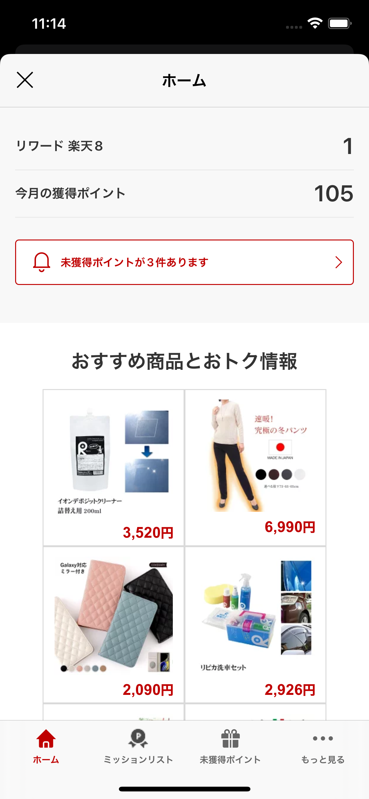
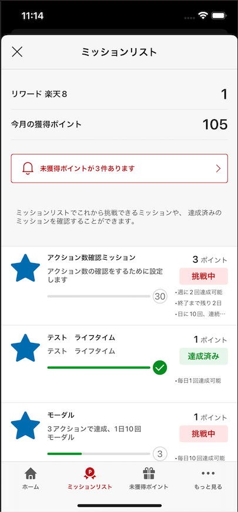
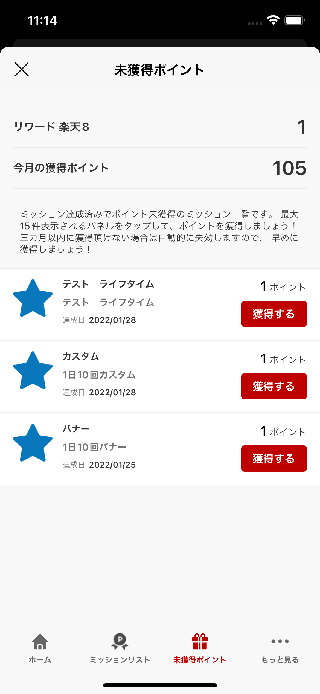
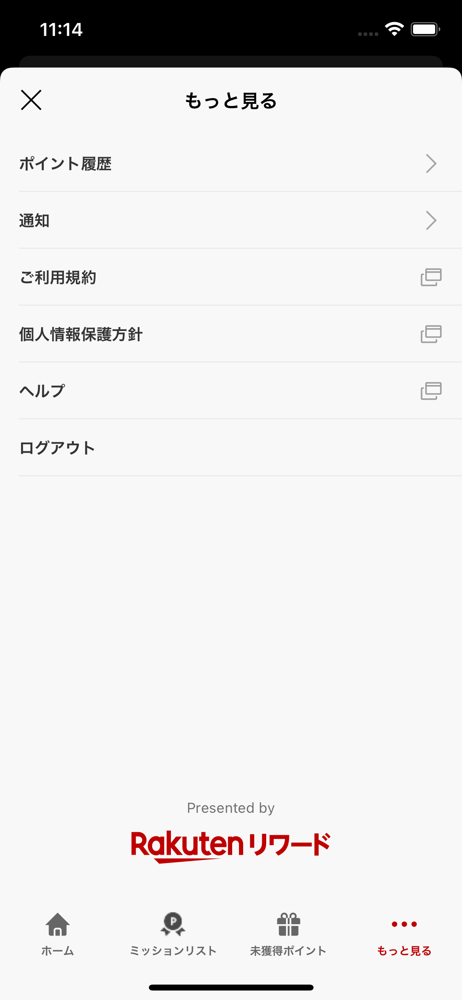
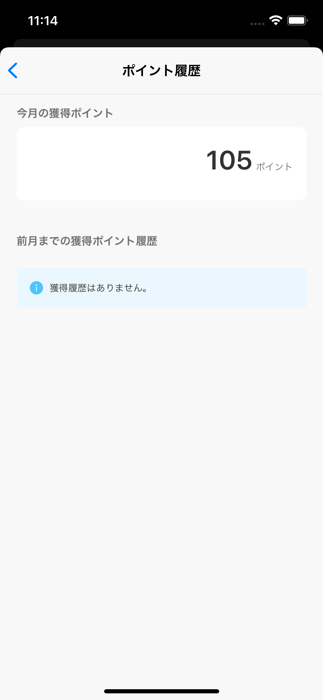

[TOP](../../README.md#top)　>　Basic Guide

Table of Contents
* [Region Setting](#region-setting)<br>
* [Authentication](#authentication)<br>
  * [Login Options](#login-options)<br>
  * [Log in](#log-in)<br>
  * [Log out](#log-out)<br>
* [Initialize SDK](#initialize-sdk)<br>
* [Getting User Information](#getting-user-information)<br>
* [Mission Achievement](#mission-achievement)<br>
* [SDK Portal](#sdk-portal)<br>
* [Ad Portal](#ad-portal)<br><br>

# Region Setting
From Version 2.1, SDK support multiple regions.
We support Japan, Taiwan(2021/02).

For Japan
```Swift
RakutenReward.shared.region = RakutenRewardRegion.JP
```

For Taiwan
```Swift
RakutenReward.shared.region = RakutenRewardRegion.TW
```

Do not use multiple setting in same app.  
We expect one application use one region.  
Each Region has differrent functions, and we cannot support each country mixed.
<br><br>

# Authentication

## Login Options
There are 3 types of login. According to your environment, please select proper one. 
<br>

| Login Option        | Description | Support |
| --- | --- | --- |
| RakutenAuth | This is default option, provide login by SDK, SDK handled all login and user identifier | Japan, Taiwan |
| RID | Rakuten ID SDK with RID, Login covers by ID SDK, and use API token for SDK| Japan |  
| RAE | Rakuten ID SDK with RAE, Login covers by ID SDK, and use token for SDK | Japan |
<br>

### Switch Login Option
By default, login option is RakutenAuth
<br>

### RakutenAuth
```swift
RakutenReward.shared.tokenType = TokenType.RakutenAuth
```
<br>

### RID

To use SDK API, developers need to set token type after login

```swift
RakutenReward.shared.tokenType = TokenType.RID
```

and pass (API-C) token value in startSession API. Access token value will be set automatically when startSessionAPI returns success

```swift
RakutenReward.shared.startSession(appCode: "Your App Key", accessToken: <Access token>, completion: { r in
    if case .success(let user) =r {  // use portal or use additional setup
  }
}
```
<br>

### RAE
To use SDK API, developers need to set token type after login

```swift
RakutenReward.shared.tokenType = TokenType.RAE
```

and pass access API token value in startSession API. Access token value will be set automatically when startSessionAPI returns success

```swift
RakutenReward.shared.startSession(appCode: "Your App Key", accessToken: <Access token>, completion: { r in
    if case .success(let user) =r {  // use portal or use additional setup
  }
}
```
<br>

## Log In

This is for external login options, If you use Rakuten Login SDK, you don't need to use this option.
<br>

```swift
RakutenReward.shared.openLoginPage({result in 
    switch result:
    case .dismissByUser: // resume in another time
    case .LogInCompleted: // starting session
    case .failToShowLoginPage: // presenting problem
  }) 
```


<br>

## Log out

Logging user out: 

```swift
RakutenReward.shared.logout { }
```
<br>

# Initialize SDK
To use Reward SDK, need to establish SDK session first (to collect SDK user's basic information)

Call startSession method with parameters


```swift
RakutenReward.shared.startSession(appCode: "Your App Key", accessToken: <Access token>, completion: { r in
    if case .success(let user) =r {  // use portal or use additional setup
  }
}
```

| Parameter name        | Description           
| --- | --- 
| appCode | Application Key (This is from Rakuten Reward Developer Portal) 
| token | Access token to access Reward SDK API-C API |
<br>

## Initialization flow with Built-in Login service
1. Check if user has logged in to Reward SDK, 
2. if not open log in page
3. Start session after log in 

```swift
if RakutenReward.shared.isLogin() {
  RakutenReward.shared.startSession(appCode: <#appcode#>, completion:<#callback#>) 
} else {
  RakutenReward.shared.openLoginPage({_ in 
    // starting session ...
  }) 
}
```
<br>

# Getting user information

### Get user's full name

```swift
RakutenReward.shared.user?.getName()
```

### Get user Current point and rank: 

```swift
RakutenReward.shared.user?.currentPointRank()
```
<br>

# Mission Achievement 
To achieve mission, developers need to call post action API.  
After achieving the mission, notification will be shown.  
<br>

## Post Action
```swift
RakutenReward.shared.logAction(actionCode: "<actionCode>", completionHandler: { actionResult in })
```
actionCode is provided by Reward SDK Developer Portal.  
<br>

## Notification UI
The user achieved the mission, notification UI is shown.  
Reward SDK provides Modal and Banner UI

     
<br>

### Notification Type
There  are 4 types of Mission Achievement UI. Modal, Banner, and No UI, and Custom which developed by developers.

You can decide type by Developer Portal 

| Notification Type        | UI
| --- | ---
| Modal | Show Modal UI provided by SDK
| Banner | Show Banner UI provided by SDK
| Custom | Developer can create UI by themselves
| No UI | Not show any UI
<br>

# SDK Portal
We provide User Portal UI for developers. In SDK Portal, developers can see user status (mission, unclaim list, current point, point history etc...)
<br>

Call Open SDK Portal API:
```swift
RakutenReward.shared.openPortal(completionHandler: { result in
    // Handle success or fail to open portal
})
```

Below are the portal UIs:










<br>

# Ad Portal
*Ad Portal APIs are available from version 9.1.0 (JP region only)
<br>

Call Open Ad Portal API:
```swift
RakutenReward.shared.openAdPortal { completion in 
    // Handle success or fail to open ad portal
}
```

Below are the portal UIs:


<br>

LANGUAGE :
> [](../ja/basic/README.md)
