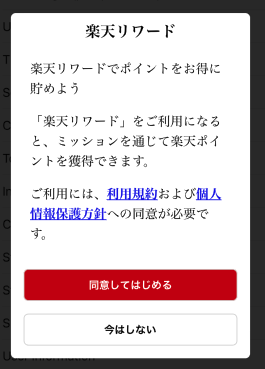

[トップ](../../README.md#top)　>　利用規約への同意について

コンテンツ
* [概要：利用規約同意を取得する](#概要利用規約同意を取得する)<br>
* [既設APIの変更](#既設apiの変更) <br>
    * [userNotConsent ステータス](#user_not_consent-ステータス) <br>
    * [新たな UserConsent callbacks 関数](#新しい-userconsent-callbacks-関数) <br>
* [利用規約への同意をリクエストする API](#利用規約への同意をリクエストする-api)
* [サンプルの使用例](#サンプルの使用例)
    * [いつ利用規約への同意をリクエストする](#いつ利用規約への同意をリクエストする)
    * [アクションを送信する](#アクションを送信する)
* [テストに関する](#テストに関する)

---

# 概要：利用規約同意を取得する
Reward SDKでは新たに、利用規約同意を取得するUIをご用意しました。<br>
Reward SDKの機能を使う前に、ユーザーがRewardの利用規約および個人情報保護方針へのご同意が必須となります。<br>
このページはこのUI及び機能を利用するための方法と、既存のAPIの変更点についてご説明します。<br>
<br><br>

# 既設APIの変更
## userNotConsent ステータス
新たにuserNotConsent Reward SDK ステータスを導入しました。[RakutenRewardStatus](../APIReference/README.md#rakutenrewardstatus) <br>
ユーザーがまだ利用規約に同意していない場合に、`userNotConsent` ステータスは `RakutenReward.shared.didUpdateStatus: ((RakutenRewardStatus) -> Void)?` に返します。<br>


## 新しい UserConsent callbacks 関数
新たな関数が [Rakuten Reward](../APIReference/README.md#rakutenreward) に加わりました。<br>
利用規約への同意ダイアログを表示すると、`RakutenReward.shared.didPresentConsentUI` の実装を呼び出します。
利用規約同意ダイアログを閉じた場合、この `RakutenReward.shared.didDismissConsentUI` の実装を呼び出します。
<br><br>

# 利用規約への同意をリクエストする API
利用規約への同意をリクエストする以下のAPIをご利用いただけます。

```Swift
RakutenReward.shared.requestForConsent { status in
    // Check consent status
}
```
ユーザーがまだ、利用規約に同意していない場合に、同意ダイアログを表示します。



ユーザーの反応によって、以下のステータスを得られます。

| RakutenRewardConsentStatus | 説明 |
| --- | --- |
| consentProvided | 同意しました |
| consentNotProvided | 同意していません |
| consentFailed | APIエラーが発生しました |
| consentProvidedRestartSessionFailed | 同意しましたが、SDKセッションの再開に失敗しました |

ユーザーがすでに利用規約を同意していた場合、ダイアログを表示せずに`consentProvided`ステータスがコールバックに返します。
<br><br>

# サンプルの使用例
## いつ利用規約への同意をリクエストする
`RakutenReward.shared.requestForConsent()` を呼ばない場合、同意ダイアログを表示しません。<br>
アプリ開発者は、いつ同意ダイアログを表示するのか？を決定します。

> `RakutenReward.shared.openPortal()` API は、利用規約に同意していない場合を処理<br>

Sample code on when to request user consent
```Swift
    // Callback when SDK status is updated
    RakutenReward.shared.didUpdateStatus = { sdkStatus in
        // If SDK status is changed to user not consent
        if sdkStatus == .userNotConsent {
            // Request for user consent, SDK will present the consent UI
            RakutenReward.shared.requestForConsent { consentStatus in
                // Handle next action depending on consentStatus
            }
        }
    }
```

## アクションを送信する
利用規約への同意がない場合、このAPIは失敗となります。 <br>
次のコード スニペットは、この状況を処理します。

```Swift
func exampleLogAction() {
    // Check if SDK is online...
    
    // Check if SDK status is user not consent
    RakutenReward.shared.requestForConsent { consentStatus in
        // Call the API if consent is provided
    }
}
```

まだ同意がない場合、ダイアログを表示します。その後、ユーザーが同意した際にアクションを送信します。

ユーザーがすでに利用規約を同意していた場合でも、`RakutenReward.shared.requestForConsent()`APIを呼び出せます。ダイアログを表示せずに、`consentProvided`ステータスがコールバックに返します。

<br>

## テストに関する
この機能はまだ有効になっていません。開発段階でこの機能をテストしたい場合、[ここ](https://confluence.rakuten-it.com/confluence/x/8Hx3sw)でチケットをテスト アカウントの Easy ID を提供して作成してください。 

---
言語 :
> [](../../UserConsent/README.md)
