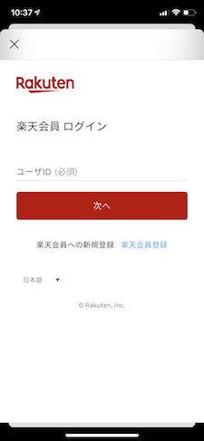
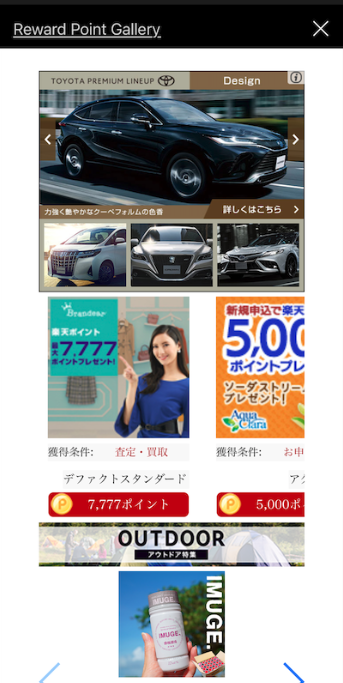

[TOP](../README.md#top)　>基本ガイド

コンテンツ
* [リージョンの設定](#リージョンの設定)<br>
* [認証](#認証)<br>
  * [ログインオプション](#ログインオプション)<br>
  * [ログイン](#ログイン)<br>
  * [ログアウト](#ログアウト)<br>
* [SDKを初期化する](#SDKを初期化する)<br>
* [楽天メンバー情報を取得する](#楽天メンバー情報を取得する)<br>
* [ミッションの達成](#mission-achievement)<br>
* [SDK ポータル](#SDK-ポータル)<br>
* [広告ポータル](#広告ポータル)<br><br>


# リージョンの設定

日本の場合
```Swift
RakutenReward.shared.region = RakutenRewardRegion.japan
```

# 認証
## ログインオプション

リワードSDKでは3種類のログインを用意しております、環境に合わせてご利用ください
<br>

注記: RAEは2025年までに廃止されます。RIDトークンまたは他のソリューションへの移行計画を立ててください。この列挙型ケースは将来のリリースで削除される予定です。


| ログインオプション | 説明 | サポート |
| --- | --- | --- |
| rakutenAuth | 初期設定、ログインに関する処理はSDKから提供されます | 日本、台湾 |
| rid | 楽天のログインSDKを使って、RIDでログインする場合はこのオプションを使用します、 SDKにAPIトークンを設定する必要があります | 日本 |  
| rae | 楽天のログインSDKを使って、RAEでログインする場合はこのオプションを使用します、 SDKにトークンを設定する必要があります | 日本 |
<br>

### ログインオプションの切り替え
初期設定では、ログインオプションは RakutenAuth　になっております
<br>

### RakutenAuth
```swift
RakutenReward.shared.tokenType = TokenType.rakutenAuth
```
<br>

### RID

**新しいv9のアプローチ（推奨）:**

RIDトークンでSDKを使用するには、`MissionTokenProvider`を実装します：

```swift
class RIDTokenProvider: MissionTokenProvider {
    static let shared = RIDTokenProvider()

    func getAccessToken() async throws -> String {
        // RIDアクセストークンをここで返します
        // ユーザーがログインしていない場合は空文字列を返します
        return "your_rid_access_token"
    }
}

// トークンプロバイダーでSDKを初期化
RakutenReward.shared.initSdk(
    appCode: "Your App Key",
    tokenType: .rid,
    tokenProvider: RIDTokenProvider.shared
)
```

**v9アプローチのメリット:**
- トークン期限切れの自動処理
- `startSession`を手動で呼び出す必要がない
- ONLINE状態を確認する必要がない
- SDKがセッションを自動的に管理

**旧アプローチ（非推奨だが引き続きサポート）:**

トークンタイプを設定し、アクセストークンを直接渡します：

```swift
RakutenReward.shared.tokenType = TokenType.rid
RakutenReward.shared.startSession(appCode: "Your App Key", accessToken: <Access token>, completion: { r in
    if case .success(let user) = r {  // use portal or use additional setup
  }
})
```

**バージョン3.3.１から、ユーザーがログアウト時にトークンやデータをちゃんと消すためにログアウトAPIを呼ぶのが必要です。** <br>
[ログアウト](#ログアウト) に参照
<br><br>


### RAE

注記: RAEは2025年までに廃止されます。RIDトークンまたは他のソリューションへの移行計画を立ててください。この列挙型ケースは将来のリリースで削除される予定です。

**新しいv9のアプローチ（推奨）:**

RAEトークンでSDKを使用するには、`MissionTokenProvider`を実装します：

```swift
class RAETokenProvider: MissionTokenProvider {
    static let shared = RAETokenProvider()

    func getAccessToken() async throws -> String {
        // RAEアクセストークンをここで返します
        // ユーザーがログインしていない場合は空文字列を返します
        return "your_rae_access_token"
    }
}

// トークンプロバイダーでSDKを初期化
RakutenReward.shared.initSdk(
    appCode: "Your App Key",
    tokenType: .rae,
    tokenProvider: RAETokenProvider.shared
)
```

**v9アプローチのメリット:**
- トークン期限切れの自動処理
- `startSession`を手動で呼び出す必要がない
- ONLINE状態を確認する必要がない
- SDKがセッションを自動的に管理

**旧アプローチ（非推奨だが引き続きサポート）:**

トークンタイプを設定し、アクセストークンを直接渡します：

```swift
RakutenReward.shared.tokenType = TokenType.rae
RakutenReward.shared.startSession(appCode: "Your App Key", accessToken: <Access token>, completion: { r in
    if case .success(let user) = r {  // use portal or use additional setup
  }
})
```

**バージョン3.3.１から、ユーザーがログアウト時にトークンやデータをちゃんと消すためにログアウトAPIを呼ぶのが必要です。** <br>
[ログアウト](#ログアウト) に参照
<br><br>


## ログイン

ログインページを開きます。楽天のログインSDKを使用する場合は必要ありません。
<br>

```swift
RakutenReward.shared.openLoginPage({result in 
    switch result:
    case .dismissByUser: // resume in another time
    case .logInCompleted: // starting session
    case .failToShowLoginPage: // presenting problem
  }) 
```


<br>

## ログアウト

ユーザーログアウト: 

```swift
RakutenReward.shared.logout { }
```
<br>

---
# SDKを初期化する

## 新しいv9のアプローチ（推奨）

**RID/RAEトークンの場合（外部認証）:**

1. `MissionTokenProvider`を実装：

```swift
class MyTokenProvider: MissionTokenProvider {
    static let shared = MyTokenProvider()

    func getAccessToken() async throws -> String {
        // アクセストークンをここで返します
        // ユーザーがログインしていない場合は空文字列を返します
        return "your_access_token"
    }
}
```

2. トークンプロバイダーでSDKを初期化：

```swift
RakutenReward.shared.initSdk(
    appCode: "Your App Key",
    tokenType: .rid, // または .rae
    tokenProvider: MyTokenProvider.shared
)
```

**組み込みログインの場合（RakutenAuth）:**

```swift
RakutenReward.shared.initSdkThirdParty(appCode: "Your App Key")
```

**v9アプローチのメリット:**
- SDKによるトークン期限切れの自動処理
- `startSession`を手動で呼び出す必要がない
- SDK機能を使用する前にONLINE状態を待つ必要がない
- SDKがセッションを自動的に管理

| パラメータ名 | 説明
| --- | ---
| appCode | アプリケーションキー（楽天リワードSDKの開発者ポータルより取得） |
| tokenType | .rid、.rae、または.rakutenAuth |
| tokenProvider | MissionTokenProviderの実装 |

## 旧アプローチ（非推奨だが引き続きサポート）

楽天リワードSDKを利用するには、旧アプローチではまず初期化が必要です。

バージョン６.１.０以降：

```swift
RakutenReward.shared.startSession(appCode: "Your App Key", accessToken: <Access token>, tokenType: <token type>, completion: { r in
    if case .success(let user) = r {  // use portal or use additional setup
  }
})
```

バージョン６.１.０の前：

```swift
RakutenReward.shared.startSession(appCode: "Your App Key", accessToken: <Access token>, completion: { r in
    if case .success(let user) = r {  // use portal or use additional setup
  }
})
```

注：旧アプローチではトークン期限切れ（TOKENEXPIREエラー）の手動処理が必要です。

<br>

## ログインページを表示し、SDKを初期化する

**新しいv9のアプローチ:**

```swift
// アプリ起動時に一度だけSDKを初期化
RakutenReward.shared.initSdkThirdParty(appCode: "Your App Key")

// ログイン状態を確認し、必要に応じてログインページを開く
if !RakutenReward.shared.isLogin() {
    RakutenReward.shared.openLoginPage { result in
        // ログイン後、SDKが自動的にセッションを管理
    }
}
```

**旧アプローチ:**

```swift
if RakutenReward.shared.isLogin() {
  RakutenReward.shared.startSession(appCode: <#appcode#>, completion:<#callback#>)
} else {
  RakutenReward.shared.openLoginPage({_ in
    // SDKセッションを開始
  })
}
```
<br>

## 楽天メンバー情報を取得する　

### ユーザーの名前を取得する

```swift
RakutenReward.shared.user?.getName()
```

### ユーザーの会員ランク楽天ポイントを取得する

```swift
RakutenReward.shared.user?.currentPointRank()
```

---
# ミッションの達成 
ミッションを達成するには、開発者はアクションAPIをコールします
ミッション達成後、ミッション達成UIが表示されます 

## アクションを送信する
```swift
RakutenReward.shared.logAction(actionCode: "<actionCode>", completionHandler: { actionResult in })
```
actionCode は開発者ポータルより取得します 

## ミッション達成UI
ユーザーがミッションを達成すると、下記のようなミッション達成UIが表示されます
楽天リワードではモーダルとバナーを用意しております

     

### ミッション達成UIの種類
楽天リワードSDKは4つの種類のミッション達成の種類があります
モーダル、バナー、UIなし、カスタム
これらの設定は開発者ポータルから設定できます

| ミッション達成UIの種類        | 説明
| --- | ---
| モーダル | モーダルUIを表示する
| バナー | バナーUIを表示する
| カスタム | 開発者が自由にUIを作成できます
| 広告バナー（小）/ Banner_50 | SDK が提供する Banner_50 UI を表示する
| 広告バナー（大）/ Banner_250 | SDK が提供する  Banner_250 UI を表示する
| UIなし | UIを表示しません

## SDK ポータル
ユーザーにリワードサービスの情報(ミッションや進捗、ポイントなど)を伝えるために
楽天リワードSDKではポータルというのを提供しております
このポータルを表示するにはポータル表示のAPIを呼ぶ必要があります

こちらがSDKポータルのイメージになります


## 広告ポータル (Deprecated from version 5.x)
Ad Portal API は SDKバージョン3.1.0 からご利用可能です(JP のみ)
<br>

Open Ad Portal API を呼んでください
```swift
RakutenReward.shared.openPortal(completionHandler: { result in
    // Handle success or fail to open portal
})
```

こちらが 広告ポータルのユーザーインターフェースになります:



<br>

---
言語 :
> [](../../basic/README.md)
