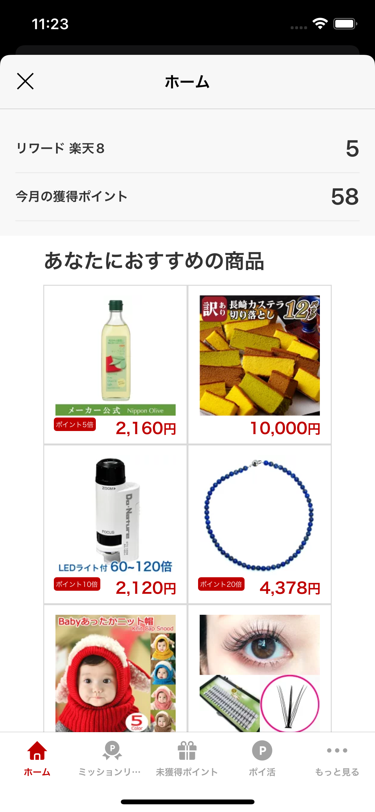
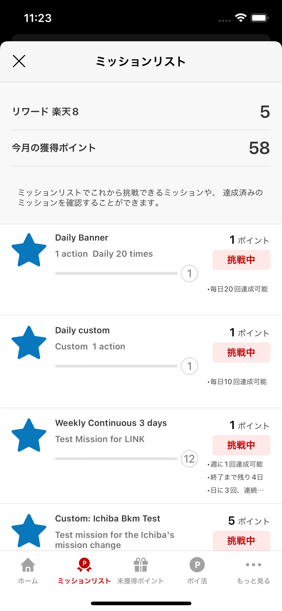
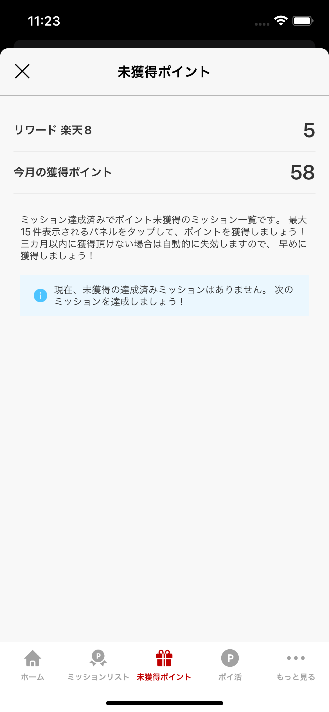
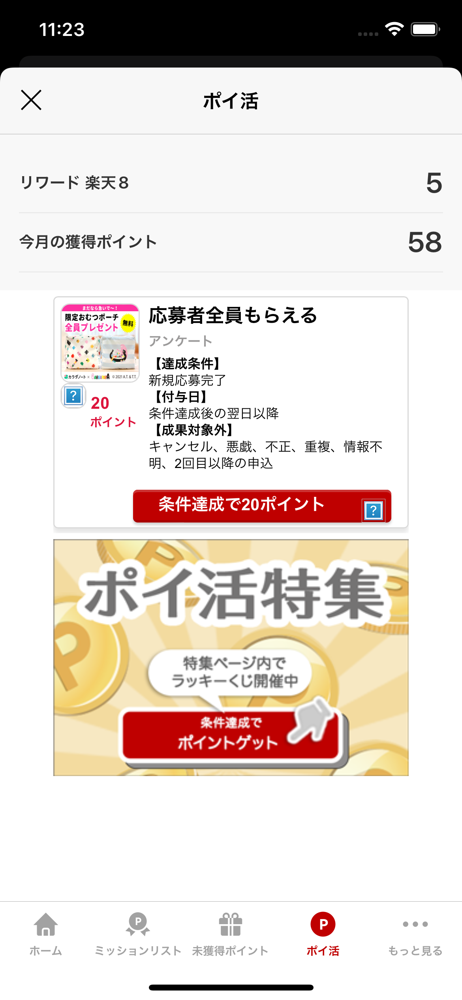

[TOP](../README.md#top)　>基本ガイド

---
# SDKを初期化する
楽天リワードSDKを利用するにははじめに初期化が必要です(SDKユーザーの基本データを取得します) SDKの機能を利用するのにはRakutenRewardクラスのメソッドを利用します

```swift
RakutenReward.shared.startSession(appCode: "Your App Key", accessToken: <Access token>, completion: { r in
    if case .success(let user) =r {  // use portal or use additional setup
  }
}
```

| パラメータ名        | 説明           
| --- | --- 
| appCode | アプリケーションキー (楽天リワードSDKの開発者ポータルより取得)
| token | Access token to access Reward SDK API-C API |

# ログインページを表示し、SDKを初期化する
1. ログインの状態をチェックする, 
2. ログインページを表示する
3. SDKを初期化する

```swift
if RakutenReward.shared.isLogin() {
  RakutenReward.shared.startSession(appCode: <#appcode#>, completion:<#callback#>) 
} else {
  RakutenReward.shared.openLoginPage({_ in 
    // SDKセッションを開始
  }) 
}
```
---

# ログイン

```swift
RakutenReward.shared.openLoginPage({result in 
    switch result:
    case .dismissByUser: // ユーザーが閉じた
    case .LogInCompleted: // ログイン完了
    case .failToShowLoginPage: // ログイン失敗
  }) 
```


# ログアウト

Logging user out: 

```swift
RakutenReward.shared.logout({ _ in
            }, forceRemoveToken: true)
RakutenReward.shared.logout({ result in
  switch result {
    case .success: // ログアウト完了　　
    case .failure: // ログアウト失敗
  }
            })
```

## 楽天メンバー情報を取得する　

### ユーザーの名前を取得する

```swift
RakutenReward.shared.user?.getName()
```

### ユーザーの会員ランク楽天ポイントを取得する

```swift
RakutenReward.shared.user?.currentPointRank()
```

---
# ミッションの達成 
ミッションを達成するには、開発者はアクションAPIをコールします
ミッション達成後、ミッション達成UIが表示されます 

## アクションを送信する
```swift
RakutenReward.shared.logAction(actionCode: "<actionCode>", completionHandler: { actionResult in })
```
actionCode は開発者ポータルより取得します 

## ミッション達成UI
ユーザーがミッションを達成すると、下記のようなミッション達成UIが表示されます
楽天リワードではモーダルとバナーを用意しております

     

### ミッション達成UIの種類
楽天リワードSDKは4つの種類のミッション達成の種類があります
モーダル、バナー、UIなし、カスタム
これらの設定は開発者ポータルから設定できます

| ミッション達成UIの種類        | 説明
| --- | ---
| モーダル | モーダルUIを表示する
| バナー | バナーUIを表示する
| カスタム | 開発者が自由にUIを作成できます
| UIなし | UIを表示しません

## SDK Portal
ユーザーにリワードサービスの情報(ミッションや進捗、ポイントなど)を伝えるために
楽天リワードSDKではポータルというのを提供しております
このポータルを表示するにはポータル表示のAPIを呼ぶ必要があります

こちらがSDKポータルのイメージになります










---
言語 :
> [](../../basic/README.md)
