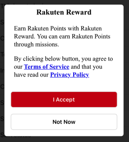

[TOP](../../README.md#top)　>　Migration Guide: Migrate from V1 SDK

Table of Contents
* [Background](#background)
* [Version History](#version-history)
* [Integration Guide](#integration-guide)
   * [Use Cocoapods](#use-cocoapods)
   * [Via Swift Package Manager (SPM) - Support starting from SDK version 3.4.4](#via-swift-package-manager-spm---support-starting-from-sdk-version-344)
   * [Via Carthage - Support starting from SDK version 3.3.0](#via-carthage---support-starting-from-sdk-version-330)
* [M1 support](#m1-support)
* [API changes on version 3.6.0](#api-changes-on-version-360)
* [Clear Token](#clear-token)
* [Removed Features](#removed-features)
    * [Action History - removed in version 3.6.0](#action-history---removed-in-version-360)
* [New Features](#new-features)
   * [New Notification Type](#new-notification-type)
   * [User Consent Feature](#user-consent-feature)

---

# Background
Version 1.x SDK is a legacy SDK, starting from version 2.x there are significant changes. This document provide a guide on how to migrate from version 1.x SDK and the required changes.

This document will also share some new features introduced since version 2.x.  

# Version history
For all version history. Please refer here to [version history](../history/README.md)

# Integration Guide
In version 1.x we only support integration using Cocoapods. In the newer version, we also support integration using Carthage and SwiftPM.

## Use Cocoapods
```
source 'https://github.com/CocoaPods/Specs.git'
source 'https://github.com/rakuten-ads/Rakuten-Reward-Native-iOS.git'

target '' do
pod 'RakutenRewardNativeSDK', '5.0.0'
end

```

## Via Swift Package Manager (SPM) - Support starting from SDK version 3.4.4

Add the dependency value below

```
dependencies: [
    .package(url: "https://github.com/rakuten-ads/Rakuten-Reward-Native-iOS-SPM", .exact("5.0.0")),
]
```

## Via Carthage - Support starting from SDK version 3.3.0

Open your project's Cartfile and add Reward Native SDK dependency

```
binary "https://raw.githubusercontent.com/rakuten-ads/Rakuten-Reward-Native-iOS/master/CarthageSpec.json"
```

Then run carthage update with XCFramework to download Reward Native SDK

```bash
carthage update --platform ios --use-xcframeworks
```

Open your app's project or workspace

Drag the binaries from Carthage/Build into the Frameworks, Libraries, and Embedded Content section of your target
<br>

# M1 support

Starting from Q4 2020, Apple released the M1 laptop. To support the new architecture, we provided an updated SDK starting from version 3.4.3.
<br><br>

# API changes on version 3.6.0

<br>SupportPage enum<br>

| Old        | New           |
--- | --- |
|Help|help|
|TermsCondition|termsCondition|
|PrivacyPolicy|privacyPolicy|

<br>RakutenRewardStatus enum<br>

| Old        | New           |
--- | --- |
|Online|online|
|Offline|offline|
|AppcodeInvalid|appcodeInvalid|
|TokenExpired|tokenExpired|

<br>SDKError enum<br>

| Old        | New           |
--- | --- |
|NoMissionFound|noMissionFound|
|NoUnclaimedItemFound|noUnclaimedItemFound|
|SessionNotInitialized|sessionNotInitialized|
|FeatureDisabledByUser|featureDisabledByUser|
|SDKStatusNotOnline|sdkStatusNotOnline|

<br>RakutenRewardRegion enum<br>

| Old        | New           |
--- | --- |
|JP|japan|

<br>TokenType enum<br>

| Old        | New           |
--- | --- |
|RID|rid|
|RAE|rae|
|RakutenAuth|rakutenAuth|

# Clear Token

To clear access token and user data when user log out, please use the following API:

```swift
@objc public func logout(completion: () -> Void)
```

<br>Example<br>
```swift
RakutenReward.shared.logout {
    // Completion
}
```
<br/>

# Removed Features

## Action History - removed in version 3.6.0

SDK will not be saving action codes from failed log action and will not be retry log action anymore when API call fails.

# New Features

## New Notification Type  
There are 2 new mission achieved notification types added since version 3.5.0.  
* Small Ad Banner
* Big Ad Banner  

<br>    
<br>  


## User Consent Feature
In Reward SDK version 5.0.0, we added support for User Consent feature where user have to provide consent before accessing Rewards Service.  
Please refer [here](../UserConsent/README.md) for more details.  

**\* Currently this feature is not enabled yet**



