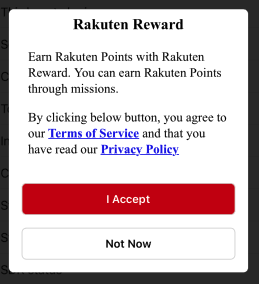
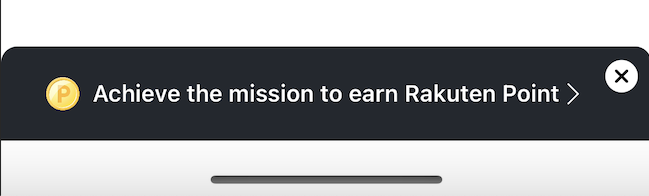

# User Consent

Since v5.0.0, users must accept the Rakuten Reward terms of service and privacy policy before the SDK's features are available. This guide explains how to request and handle that consent.

---

## How It Works

- When the SDK detects the user has not consented, it sets its status to `.userNotConsent`.
- **The SDK never shows the consent UI automatically.** Your app must call `requestForConsent()` at the right moment.
- `openPortal()` is the one exception — it handles consent internally before opening the portal.

---

## Requesting Consent

Show the consent dialog when appropriate (e.g., after login, or when you detect `.userNotConsent` status):



```swift
RakutenReward.shared.requestForConsent { status in
    switch status {
    case .consentProvided:
        // User agreed — proceed normally
    case .consentNotProvided:
        // User dismissed without agreeing
    case .consentFailed:
        // API error — retry or inform the user
    case .consentProvidedRestartSessionFailed:
        // User agreed but session restart failed — retry initSdk
    case .consentUIAlreadyPresented:
        // Dialog is already on screen — ignore
    }
}
```

If the user has already provided consent, the dialog is skipped and `.consentProvided` is returned immediately. It is always safe to call this method.

---

## Consent Notification Banner

For a less intrusive prompt, show a banner that the user can tap to open the full consent dialog:



```swift
RakutenReward.shared.showConsentBanner { status in
    // Same RakutenRewardConsentStatus values as above
}
```

The banner is only shown when consent has not been provided. If the user has already consented, the callback returns `.consentProvided` immediately without showing any UI.

---

## Detecting When Consent Is Needed

The recommended pattern is to monitor SDK status changes:

```swift
RakutenReward.shared.didUpdateStatus = { status in
    if status == .userNotConsent {
        RakutenReward.shared.requestForConsent { consentStatus in
            // Handle consentStatus
        }
    }
}
```

---

## Consent Callbacks

Subscribe to these if you need to coordinate UI during the consent flow:

```swift
RakutenReward.shared.didPresentConsentUI = {
    // Consent dialog appeared — pause background activity if needed
}

RakutenReward.shared.didDismissConsentUI = {
    // Consent dialog was dismissed
}
```

---

## Most SDK APIs Require Online Status

Most SDK APIs fail if the status is not `.online`. If you call an API while status is `.userNotConsent`, guard it with a consent check first:

```swift
func performActionIfReady() {
    guard RakutenReward.shared.status == .online else {
        RakutenReward.shared.requestForConsent { status in
            if status == .consentProvided {
                RakutenReward.shared.logAction(actionCode: "code") { _ in }
            }
        }
        return
    }
    RakutenReward.shared.logAction(actionCode: "code") { _ in }
}
```

---

## Consent Status Reference

| Status | Meaning |
|---|---|
| `consentProvided` | User has accepted the terms |
| `consentNotProvided` | User has not yet accepted |
| `consentUIAlreadyPresented` | The dialog is currently on screen |
| `consentFailed` | An API error occurred |
| `consentProvidedRestartSessionFailed` | Consent accepted but session restart failed |

---

## Testing

To test consent flows in development, contact the Reward SDK team to whitelist your test account Easy IDs.
