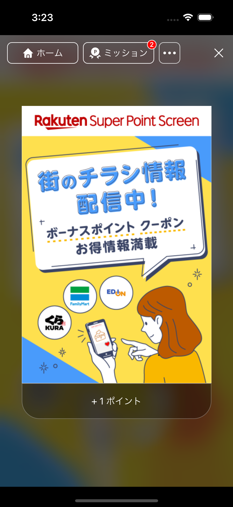
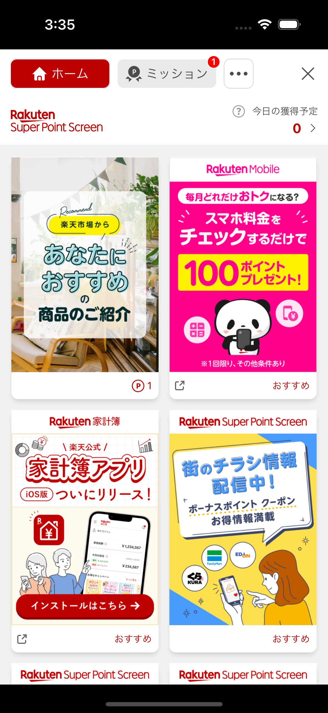
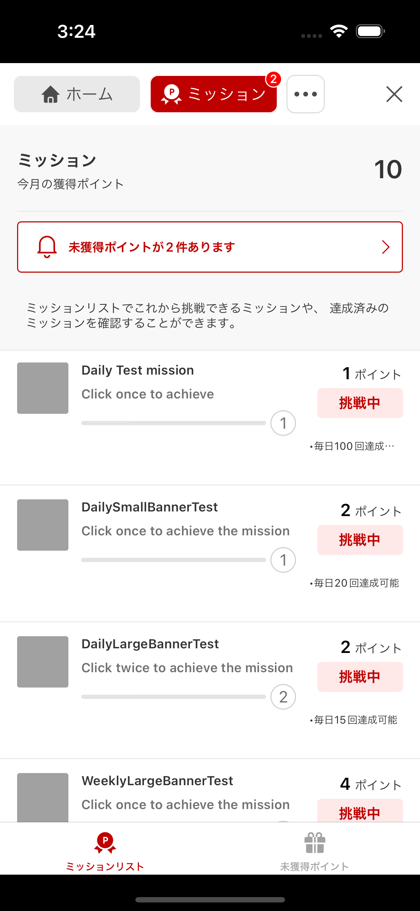
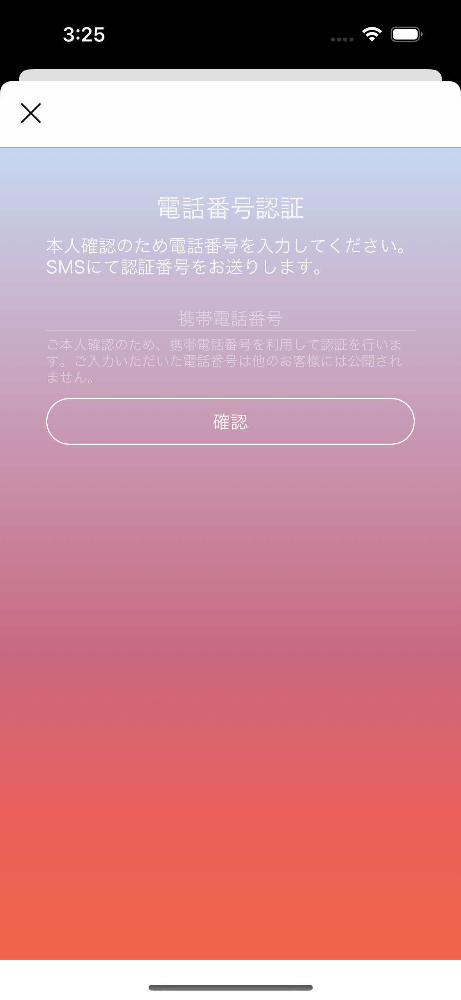
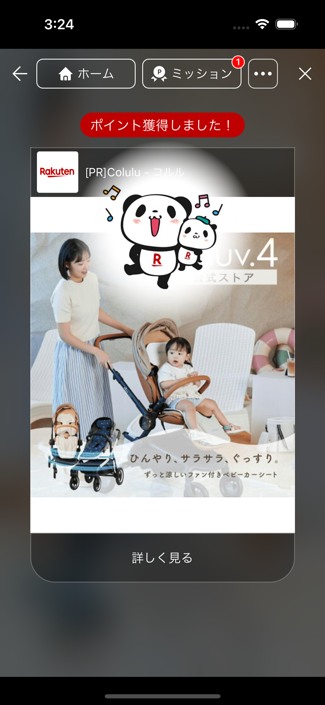
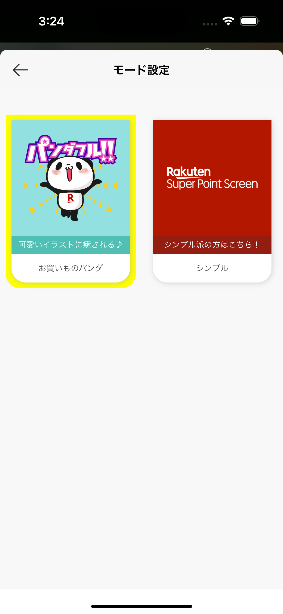

# Super Point Screen (SPS)

Super Point Screen (SPS) is an ad-based feature that lets users earn SPS points by viewing and interacting with ads. It is an optional add-on to the main Reward SDK.



---

## Prerequisites

- The SPS feature must be **enabled for your application** by the SPS team. Contact them before starting integration.
- Requires Reward SDK 7.0.0 or later.

---

## Installation

SPS requires two additional XCFrameworks — `ScreenSDK` and `ScreenSDKCore` — alongside the main `RakutenRewardNativeSDK`.

### CocoaPods

```ruby
source 'https://github.com/CocoaPods/Specs.git'
source 'https://github.com/rakuten-ads/Rakuten-Reward-Native-iOS.git'

target 'YourApp' do
  pod 'RakutenRewardNativeSDK', '9.0.0'
end
```

---

## Authentication

SPS uses a separate authentication system from the main Reward SDK. You must obtain an SPS-compatible token using the CAT exchange mechanism.

### Required CAT Scopes

If you need information about the required audience and scope configuration for SPS, please contact us for guidance.

### Implementing `SdkTokenProvider`

`SdkTokenProvider` is a class from `ScreenSDKCore`. Import the framework to use it:

```swift
import ScreenSDKCore

class SPSTokenProvider: SdkTokenProvider {
    static let shared = SPSTokenProvider()

    func getSpsCompatToken(completionHandler: @escaping (SpsCompatToken?, Error?) -> Void) {
        // Pass your CAT exchange token here
        let token = SpsCompatToken.CatExchange(tokenValue: "YOUR_EXCHANGE_TOKEN")
        completionHandler(token, nil)
    }
}
```

---

## Initialization

Initialize SPS once at app launch, after initializing the main Reward SDK:

```swift
RakutenMissionSps.shared.initSps(platform: "YOUR_PLATFORM_NAME") {
    SPSTokenProvider.shared
}
```

Contact the SPS team for the correct `platform` name for your application.

---

## Opening the SPS Portal

```swift
RakutenReward.shared.openSpsPortal(rzCookie: yourRzCookie) { result in
    switch result {
    case .success:
        break
    case .failure(let error):
        // Handle SDKError
    }
}
```

The `rzCookie` parameter is mandatory from v8.5.0. You can set it centrally:

```swift
RewardConfiguration.rzCookie = "your_rz_cookie"
```

 

### Non-SPS Members

If the logged-in user is not yet an SPS member, a registration screen is displayed before the main portal. The user can register from that screen.



---

## Claim Point Screen

When the SPS library is present, the standard Reward SDK claim point screen is replaced with an SPS-enhanced version.



---

## Theme Synchronization

Users can choose between two themes in the SPS Portal settings screen:



| Theme | Description |
|---|---|
| Panda | Okaimono Panda themed UI |
| Simple | Clean, minimal UI |

### Listening for Theme Changes

React to theme changes the user makes inside SPS:

```swift
RakutenMissionSps.shared.didUpdateAppTheme = { theme in
    // Sync theme to your app's settings if desired
}
```

### Setting the Theme from Your App

Push a theme selection to the SDK:

```swift
// Panda theme
RewardConfiguration.setTheme(.panda)

// Simple theme
RewardConfiguration.setTheme(.simple)
```
