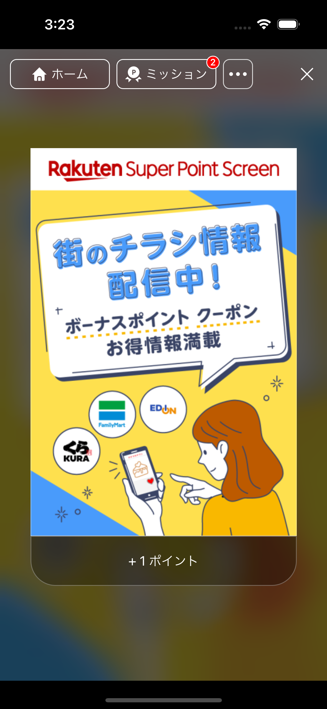
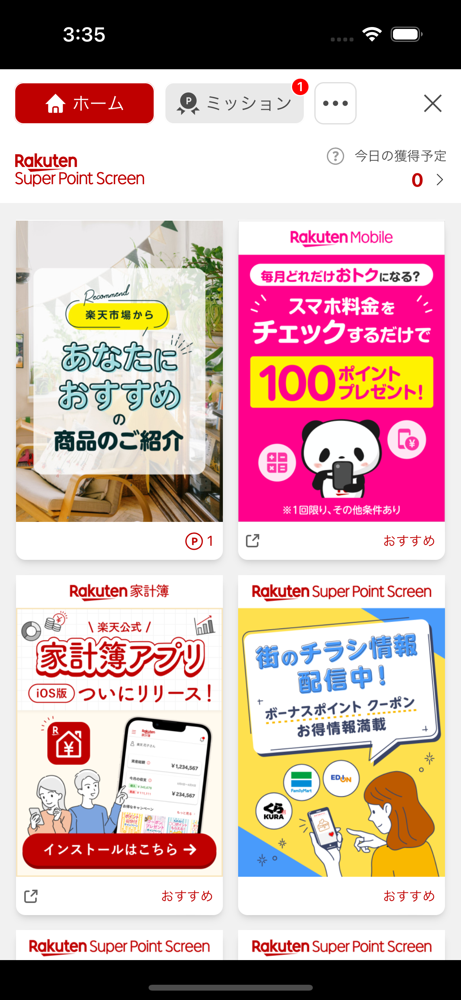
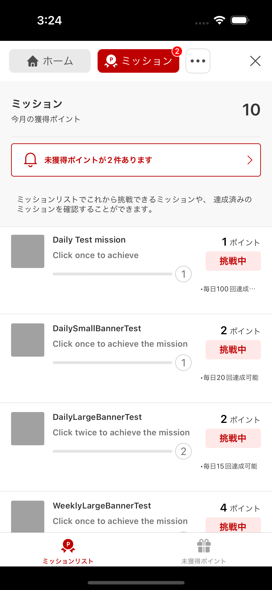
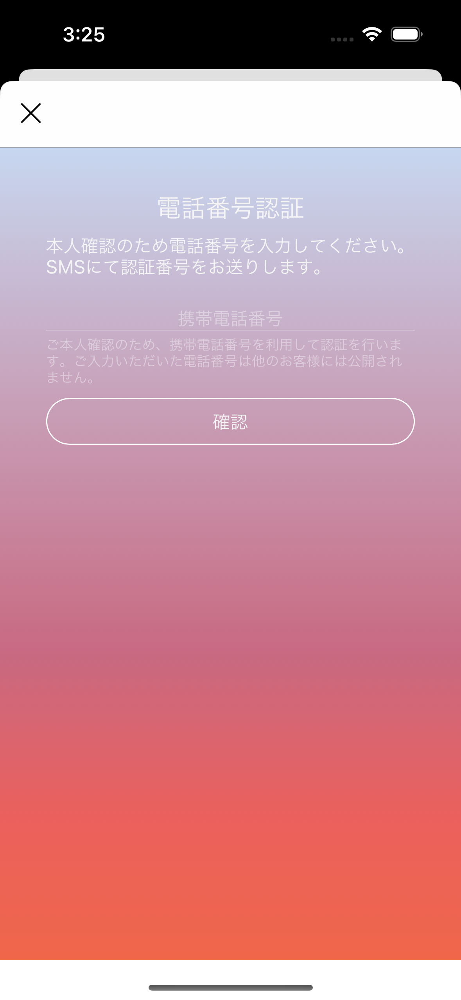
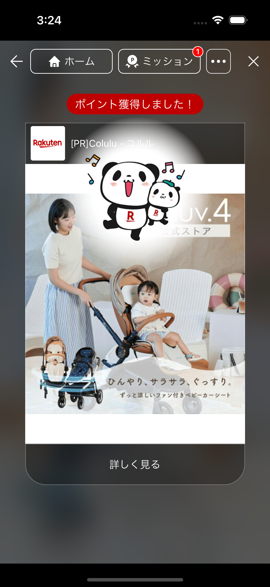
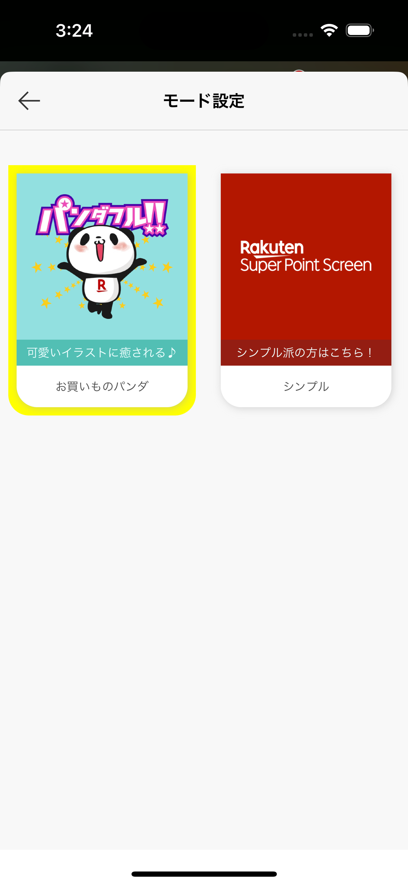

[TOP](../../README.md#top) > SPS feature  

Table of Contents  
* [Overview](#overview)  
* [Import SPS library](#import-sps-library)  
* [Enable SPS feature](#enable-sps-feature)  
* [Authentication](#authentication)  
    * [ID SDK](#id-sdk)  
* [Initialize SPS](#initialize-sps)  
* [Show SPS Portal](#show-sps-portal)  
* [Claim Point Screen](#claim-point-screen)  
* [Theme Setting Screen](#theme-setting-screen)

---  

# Overview  
Mission SDK provides a new feature which integrate Super Point Screen (SPS) Ad.  
The purpose is to allow end users to earn SPS points. 

# Import SPS Library  
 
### Use Cocoapods
```
source 'https://github.com/CocoaPods/Specs.git'
source 'https://github.com/rakuten-ads/Rakuten-Reward-Native-iOS.git'

target '' do
pod 'RakutenRewardNativeSDK', '7.0.0'
end

``` 

# Enable SPS feature
In order to use the SPS feature in Mission SDK, please ask SPS BU to enable the feature for your application.  

# Authentication  
Due to Mission SDK and SPS have different system for authentication, so we can't share the same token among two SDKs.  
Please follow the instruction below according to the authentication options the client app is using.  

## ID SDK  
The client app need to include the following audience and scopes in the CAT configuration.  
| Audience | Scopes |
| --- | --- |
| rakuten_sp_scr_web | <ul><li>sps-basic</li><li>sps-point</li><li>sps-register</li><li>sps-fast-reg</li></ul> |  

<br>  

# Initialize SPS  
Initialize SPS feature with the following API  
```swift
RakutenMissionSps.shared.initSps(platform: String, sdkTokenProvider: () -> SdkTokenProvider)

RakutenMissionSps.shared.initSps(platform: "example") {
    TokenProvider.shared
}
```  
Please check with SPS team regarding the `platform-name`.  

## SdkTokenProvider

SdkTokenProvider is a class from 'ScreenSDKCore'. Import 'ScreenSDKCore' framework to use

```swift
class TokenProviderExample: SdkTokenProvider {
    static let shared = TokenProvider()

    func getSpsCompatToken(completionHandler: @escaping (SpsCompatToken?, Error?) -> Void) {
        completionHandler(SpsCompatToken.CatExchange(tokenValue: "exchangeToken"), nil) // pass your exchange token here
    }
}
```

# Show SPS Portal  
The following API will display SPS Portal as shown below.   
  

```swift
RakutenReward.shared.openSpsPortal { result in
    // handle callback
}
```  
Screenshots of the SPS Portal  

    

## Non-SPS member
If the logged in user is not a SPS member, a member registration screen will be shown first.  

  

# Claim Point Screen  
Importing this SPS library will update the Claim Point screen as well.  
Below is a screenshot of the new screen.  
  

# Theme Setting Screen
In the SPS Portal settings screen, users are able to set their desire theme.   
  
Currently we support 2 themes: 
| Mission Theme |
| --- |
| Panda |
| Simple |

If your application also provide theme options and would like to sync the selected theme, you can implement the callback to SDK.    
```swift
RakutenMissionSps.shared.didUpdateAppTheme = { theme in
    // Check latest theme
}
```  

You can call the following API to sync the theme setting from your application to Mission SDK.  
```kotlin
// set to Okaimono Panda theme
RewardConfiguration.setTheme(.panda)

// or set to Simple theme
RewardConfiguration.setTheme(.simple)
```

---
LANGUAGE :
